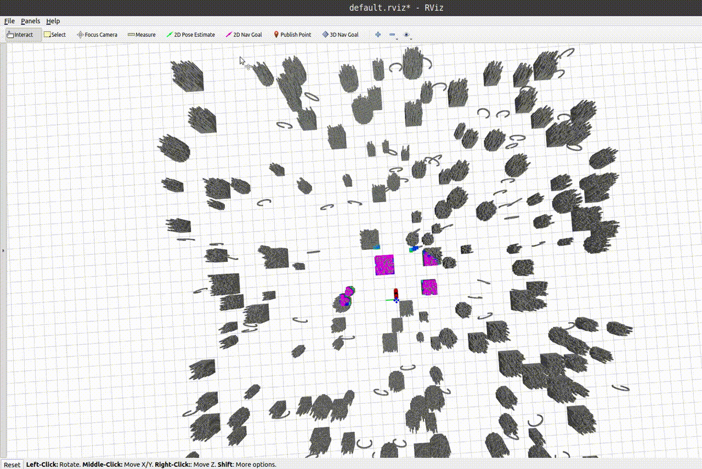

# Fast-Tracker

A Robust Aerial System for Tracking Agile Target in Cluttered Environments

## 0. Overview
**Fast-Tracker** is a systematic  solution  that uses  an  unmanned  aerial  vehicle  (UAV)  to  aggressively  and safely track an agile target. 

**Author**: Zhichao Han\*, Ruibin Zhang\*, Neng Pan\*, Chao Xu\* and [Fei Gao](https://ustfei.com/) from the [ZJU Fast Lab](www.kivact.com/). 

**Related Paper**: [Fast-Tracker: A Robust Aerial System for Tracking AgileTarget in Cluttered Environments](https://arxiv.org/abs/2011.03968), Zhichao Han\*, Ruibin Zhang\*, Neng Pan\*, Chao Xu, Fei Gao, accepted, International Conference on Robotics and Automation (ICRA 2021)

**Video Links**: [youtube](https://www.youtube.com/watch?v=w8ECy6rgYa8) or [bilibili](https://www.bilibili.com/video/BV1xr4y1w7RJ)


### Contributions
-  A lightweight and intent-free target motion prediction method.
-  A safe tracking trajectory planner consisting of a target informed kinodynamic searching front-end and a spatial-temporal optimal trajectory planning back-end.
-  The integration of the proposed method with sensing and perception functionality and the presentation of the systematic solution with extensive evaluations.

## 1. Prerequisites
Our software is developed and tested in Ubuntu 18.04, ROS Melodic. Other version may require minor modification. 

ROS can be installed here: [ROS Installation](http://wiki.ros.org/ROS/Installation).

### Step 1

Install [Armadillo](http://arma.sourceforge.net/), which is required by **uav_simulator**.

```
sudo apt-get install libarmadillo-dev
```

### Step 2

Install [ompl](https://ompl.kavrakilab.org/), which is required by **car_planner**.

```
sudo apt-get install ros-melodic-ompl
```

### Step 3

In **target prediction** part, we use **OOQP** for quadratic programming.

1. Get a copy of **MA27** from the [HSL Archive](http://www.hsl.rl.ac.uk/download/MA27/1.0.0/a/). Just select the **Personal Licence (allows use without redistribution)**, then fill the information table. 

​        Then you can download it from an e-mail sent to you. Next, un-zip **MA27**, and follow the *README* in it, install it to your Ubuntu.

**Actually, you only need to type 3 commands in MA27's folder to finish the installation.**

```
./configure
make
sudo make install
```

2. Manually un-zip packages *OOQP.zip* in the repo and install it to your Ubuntu.

**As above, you can just type 3 commands in OOQP's folder :**

```
./configure
make 
sudo make install
```

## 2. Build on ROS

You can create an empty new workspace and clone this repository to your workspace: 

```
cd ~/your_catkin_ws/src
git clone https://github.com/ZJU-FAST-Lab/Fast-tracker.git
cd ..
```
Then, compile it.

```
catkin_make
```

## 3. Run the Simulation

```
source devel/setup.bash
./simulation
```
Then you can follow the gif below to enjoy it.

 ## 4. Use GPU or Not

 Packages in this repo, **local_sensing** have GPU, CPU two different versions. By default, they are in CPU version for better compatibility. By changing

 ```
set(ENABLE_CUDA false)
 ```

 in the _CMakeList.txt_ in **local_sensing** packages, to

 ```
set(ENABLE_CUDA true)
 ```

CUDA will be turned-on to generate depth images as a real depth camera does. 

Please remember to also change the 'arch' and 'code' flags in the line of 

```
    set(CUDA_NVCC_FLAGS 
      -gencode arch=compute_70,code=sm_70;
    ) 
```

in _CMakeList.txt_, if you encounter compiling error due to different Nvidia graphics card you use. You can check the right code [here](https://github.com/tpruvot/ccminer/wiki/Compatibility).

Don't forget to re-compile the code!

**local_sensing** is the simulated sensors. If ```ENABLE_CUDA``` **true**, it mimics the depth measured by stereo cameras and renders a depth image by GPU. If ```ENABLE_CUDA``` **false**, it will publish pointclouds with no ray-casting. Our local mapping module automatically selects whether depth images or pointclouds as its input.

For installation of CUDA, please go to [CUDA ToolKit](https://developer.nvidia.com/cuda-toolkit)

## 5. Licence
The source code is released under [GPLv3](http://www.gnu.org/licenses/) license.

## 6. Maintaince

For any technical issues, please contact Zhichao Han (zhichaohan@zju.edu.cn), Ruibin Zhang (ruibin_zhang@zju.edu.cn), Neng Pan(panneng_zju@zju.edu.cn) or Fei GAO (fgaoaa@zju.edu.cn).

For commercial inquiries, please contact Fei GAO (fgaoaa@zju.edu.cn).
